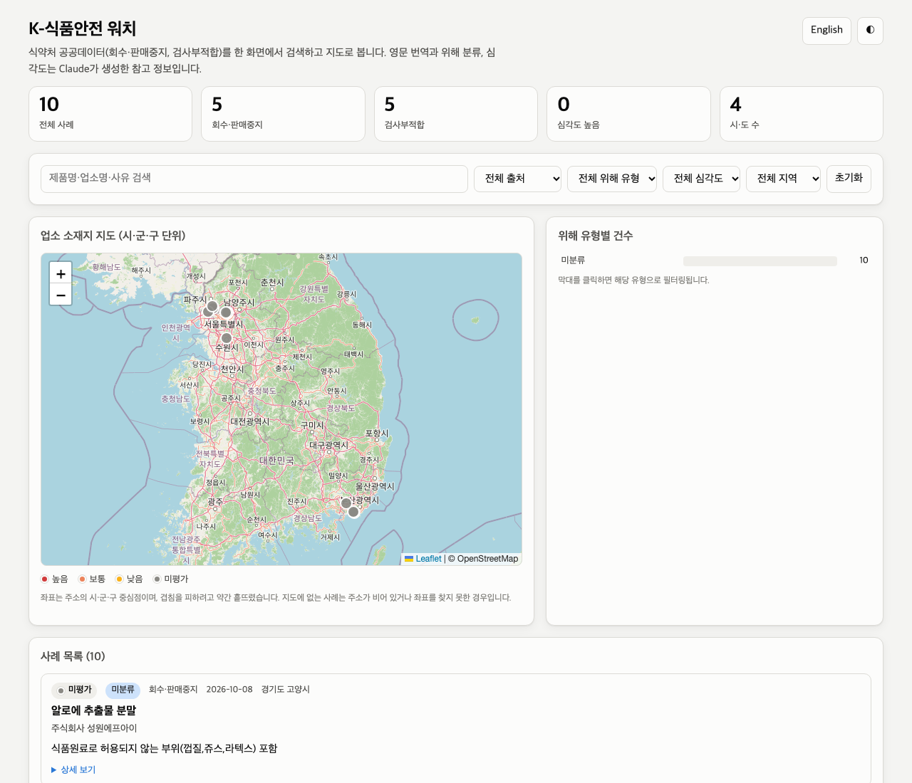

# K-Food Safety Watch · K-식품안전 워치

A small, complete demonstration of building with Claude Code:
live Korean food-safety enforcement data from the MFDS open API,
enriched by Claude, rendered to one local HTML page with a map,
in Hangul and English.

식약처 공공데이터(회수·판매중지, 검사부적합)를 가져와 Claude로
영문 번역·위해 분류·심각도 평가를 더한 뒤, 서버 없이 열리는
HTML 한 장으로 만듭니다. 한국어/영어 전환 버튼이 있습니다.

Built in one sitting in Hongdae, Seoul, 2026-10-09, as a teaching
example. **Read `PLAN.md` and `docs/METHODOLOGY.md` first.** The
process is the lesson; the app is the evidence.

**New to all of this?** Start with the step-by-step guide for
non-developers: [`docs/K-Food-Safety-Watch-Guide.pdf`](docs/K-Food-Safety-Watch-Guide.pdf).
It explains the two Claudes, walks through setup on macOS and
Windows, and shows how to get both keys. Its last chapters show how the
same recipe applies to any field with a public API and an expert. Source: `docs/guide/guide.html`;
regenerate with headless Chrome (see the end of `docs/METHODOLOGY.md`).



## What it does

| Step | Tool | Output |
|---|---|---|
| fetch | MFDS 식품안전나라 open API (`urllib`, no SDK) | `data/raw/*.json`, `data/records.json` |
| enrich | Claude, structured output, 20 records per call | `data/enriched.json` |
| geocode | OpenStreetMap Nominatim, district level, cached | `data/geocache.json` |
| env | Open-Meteo marine + weather for 8 bays, PSP conditions index, Claude advisory | `data/env.json`, `data/env_advisory.json` |
| build | HTML template + embedded JSON | `output/index.html` |

Claude does only the judgement work: English translation of product,
company and reason; one of ten hazard categories; a consumer-health
severity with a stated reason; a one-sentence summary in both
languages. Everything mechanical is plain, tested Python.

The page has a KO/EN toggle, a theme toggle, a free-text search,
filters for source, hazard, severity and province, a Leaflet map of
business locations coloured by severity, a clickable bar chart of
hazard types, and a case list with full MFDS details.

## The environmental tab (phase 2)

A second tab shows, for eight south-coast shellfish bays, whether the
last seven days of sea temperature, rainfall, wind and season favour
a paralytic-shellfish-poisoning bloom. Keyless Open-Meteo data, a
deterministic tested index, and one Claude step that writes a
bilingual advisory per bay with an explicit confidence. It is a
conditions index, not a toxin measurement, and it says so. Design
and the production replacements are in `docs/ENVIRONMENT.md`.

## The forecast slot (phase 3)

Each bay card also carries a 14-day forecast of the conditions index
with a p10–p90 band and a next-season outlook. Today it is filled by a
**synthetic**, deterministic generator and badged as such everywhere.
It exists to fix the contract a real predictive model must meet; the
model replaces one function. Contract and rules: `docs/PREDICTION.md`.
Roadmap for the team: `docs/Shellfish-Prediction-Roadmap.pdf`.

## Quick start (no keys needed)

```bash
git clone https://github.com/robertdcurrier/korean_food_safety.git
cd korean_food_safety
python3 -m venv .venv && source .venv/bin/activate
pip install -e .
python -m kfs all
open output/index.html        # macOS; or double-click the file
```

Without keys you get the five public sample rows per service, no AI
fields, Korean only. That is the point: it works in five minutes,
then each key you add makes it better.

## Adding keys

Copy `.env.example` to `.env` and fill in what you have. `.env` is
git-ignored.

| Key | Gets you | How |
|---|---|---|
| `ANTHROPIC_API_KEY` | translations, hazard classes, severity, summaries | https://platform.claude.com |
| `MFDS_API_KEY` | the full dataset (hundreds of rows, not 5) | `docs/MFDS_API.md` |
| `KFS_MODEL` | a different Claude model (default `claude-opus-5-5`) | optional |

Then:

```bash
python -m kfs all              # or step by step:
python -m kfs fetch
python -m kfs enrich --max 40  # cap spend while experimenting
python -m kfs geocode
python -m kfs env              # environmental tab
python -m kfs build
```

Enrichment is cached by record id, so re-running only sends new
records. Delete an entry from `data/enriched.json` to redo it.

## Repo map

```
PLAN.md               the plan, written before the code
CLAUDE.md             standards and method Claude Code reads every session
docs/METHODOLOGY.md   the working method, step by step, with the prompts that worked
docs/PROMPT_LOG.md    the actual prompts that produced this repo
docs/MFDS_API.md      the API as observed: URL shape, codes, field dictionary
docs/ENVIRONMENT.md   the PSP tab: data, index, what production replaces
docs/PREDICTION.md    the forecast contract and the synthetic generator
src/kfs/mfds.py       API client and record normalisation
src/kfs/enrich.py     the one place Claude runs; schema and system prompt
src/kfs/geocode.py    address splitting and cached Nominatim lookups
src/kfs/env.py        Open-Meteo fetch and the PSP conditions index
src/kfs/advisory.py   Claude's bilingual advisory per bay
src/kfs/predict.py    the forecast contract and its synthetic filler
src/kfs/report.py     merge and render
src/kfs/cli.py        python -m kfs {fetch,enrich,geocode,build,all}
templates/report.html the page: all UI strings in one KO/EN table
tests/                offline tests for every deterministic transform
data/                 committed results of the last run
output/index.html     the committed page; open it directly
```

## Tests

```bash
python -m unittest discover -s tests -v
```

## Honesty notes

- AI fields are advisory and say so in the page footer. They are not
  an official MFDS determination. Always check the original record.
- Map points are district centroids, jittered. They show the region
  of the responsible business, not where a product was sold.
- Data source: 식품의약품안전처 식품안전나라 공공데이터.
- Map: province outlines from KOSTAT via the southkorea-maps
  project are embedded in the page, so the map works offline and
  from the file system. Esri World Street Map tiles are drawn over
  them when reachable and dropped automatically when not.
  OpenStreetMap's own tile server was tried first and refused
  file:// pages with a 403; a useful lesson in reading a policy.

## Next exercises

See the end of `docs/METHODOLOGY.md`.
